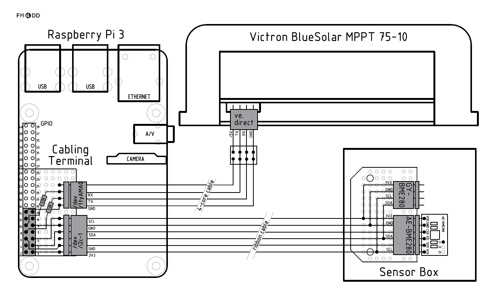

# Pi-Solar
## Background
The software package **pi-solar** monitors photovoltaic (solar) power generation. I wrote it for size evaluation on a *off-grid* solar system that provides independent power to a outdoor Raspberry Pi weather station. *Off-grid* solar power generation requires a careful design and balance of parameters for uninterrupted, longterm power generation.

Pi-solar likewise can run stand-alone, without connecting to the Internet (except during installation to download approx. 100MB of required software packages). For stand-alone mode, its best to run the Raspberry Pi with a battery-backed real time clock (RTC) to ensure the data readings are always correctly timestamped.

##  Hardware Design
In the current setup, the solar systems electrical data is generated by a <a href="https://www.victronenergy.com/solar-charge-controllers">Victron MPPT solar charge controller</a> from Victron Energy's <a href="https://www.victronenergy.com/upload/documents/Datasheet-BlueSolar-Charge-Controller-overview-EN.pdf">BlueSolar</a> series. In default mode, Victron controllers write a set of 18 parameters in one-second intervals to the serial line interface, as specified in the *ve.direct* protocol. For interfacing a Raspberry Pi with a Victron MPPT charge controller, the wiring diagram is shown below.



## Software Dependencies

Pi-solar runs on a Raspberry Pi under Raspbian Linux 9. It will install a <a href="https://www.lighttpd.net/">lighttpd</a> webserver with PHP as the user interface, and the <a href="http://www.rrdtool.org">RRD</a> packages for the database backend.

System note for Raspberry Pi 3: The more reliable serial interface */dev/ttyAMA0* should be freed up from the Bluetooth interface and routed to the GPIO. This can be achieved by disabling Bluetooth through a device overlay setting in */boot/config.txt*:

`dtoverlay = pi3-disable-bt`

This will swap the serial devices. */dev/serial0* should now point to */dev/ttyAMA0* instead of */dev/ttyS0*:

```
pi@pi-ws03:~ $ ls -l /dev/serial*
lrwxrwxrwx 1 root root 7 Apr 26 19:17 /dev/serial0 -> ttyAMA0
lrwxrwxrwx 1 root root 5 Apr 26 19:17 /dev/serial1 -> ttyS0
```

## Software Installation
After connecting the charge controllers serial port to the Raspberry Pi and downloading this software package, the configuration file *etc/pi-solar.conf* needs to be edited. Then, the script <a href="install/setup.sh">setup.sh</a> in the <a href="install/">install</a> directory makes the necessary system changes. It installs dependend software packages, creates the RRD database *rrd/solar.rrd*, compiles the 'C' programs in <a href="src/">src</a> and creates the cron job entry in */etc/crontab* for data collection.

## Directory Structure

*/home/pi/pi-solar*

| SubDir | Description |
|-------|--------------|
|backup/|Backup files for system-wide crontab and fstab before update by pi-solar|
|bin/|Location for the pi-solar program binaries such as getvictron after compilation|
|etc/|Main configuration file pi-solar.conf, and sftp batch files for Internet upload|
|install/|One-time installation scripts|
|rrd/|RRD database file solar.rrd|
|src/|‘C’ source code and scripts|
|var/|Temporary files. Directory mounted as “Ramdisk” (does not survive reboot)|
|web/|Webserver document home directory (unless integrated with pi-weather package)|

## Software Design
The cron job calls the script <a href="src/solar-data.sh">solar-data.sh</a> in one-minute intervals. This script calls the program <a href="src/getvictron.c">getvictron</a>, which reads the controllers serial data. After capturing the serial line *ve.direct* data record, *getvictron* calculates power values and writes the results into a html code segment before returning the RRD data block which is formatted for updating the RRD database. The script *solar-data.sh* then calls rrdtool update,  which writes the data into the RRD database.

Next, *solar-data.sh* calls <a href="/src/sloar-rrd.sh">solar-rrd.sh</a>, which creates the graph images for data visualization and longterm trending. The graph image files are written into the web server directory and get embedded in a web page, together with the HTML-code segment created by *getvictron*.

Finally, *solar-data.sh* can upload the previously created HTML-code and RRD update string to a Internet server. The Internet server runs a second instance of the RRD database. By running a similar update script, it displays the same data for remote viewing.

One more script exists: <a href="src/solar-night.sh">solar-night.sh</a> uploads a database export each night to the Internet server, if that server is configured. That compensates for any upload outages during the day and re-syncs the server. Its also a basic form of database "backup".

The source code contains two helper programs, <a href="src/daytcalc.c">daytcalc</a> and <a href="src/pvpower.c">pvpower</a>:

*daytcalc* calculates the sunrise and sunset times for a specific place on earth, described by its GPS coordinates. When used with a timestamp, it returns either '0' (day) or '1' (night). This is added as input to the RRD datase, and used to shade the graph images for nighttime/daytime visualization. The calculation should be roughly accurate to a minute.


```
pi@pi-ws03:~/pi-solar/bin $ ./daytcalc -t 1486784589 -x 139.628999 -y 35.610381 -v
Local timezone diff: 32400s (9hrs)
Origin UTCtimestamp: 1486784589
Local calctimestamp: 1486816989
Local timezone date: Sat Feb 11 12:43:09 2017
The day of the year: 42

Local sunrise:  6:33 sunset: 17:19
Local sunrise: Sat Feb 11 06:33:00 2017
Local  sunset: Sat Feb 11 17:19:00 2017
Daylight time: 10:46
Calc TS: 1486816989 SunriseTS: 1486794780 SunsetTS: 1486833540
RRD return value: 0 (day)
```

A RRD graph example with nighttime shading applied:


*pvpower* queries the RRD database, but instead of creating a graph it creates a summary table.  It runs through the data set of a given period and writes the daily power generation and energy balance values as a HTML table segment file, e.g. *daypower.htm*. *pvpower* is called from *solar-rrd.sh*.


## Demonstration URL

The software and current solar power generation data can be seen live at <a href="http://weather.fm4dd.com/pi-ws03/solar.php">http://weather.fm4dd.com/pi-ws03/solar.php</a>

Partial static web page content screenshot:


## To-Do List

1. Serial line data capture improvement:

Currently, the serial data capture is not very efficiently done by getvictron. Basically, it records all serial data for two seconds, and then extracts the last complete data record. Although this method seems reliable, it is far from ideal. Instead, we should monitor the serial link, identify and capture the next new data block start record by following the data stream of the link.

2. Deep cycle battery state of charge

Adding the charge level approximation to the Battery voltage graph would give valuable information to identify extensive battery draw.
